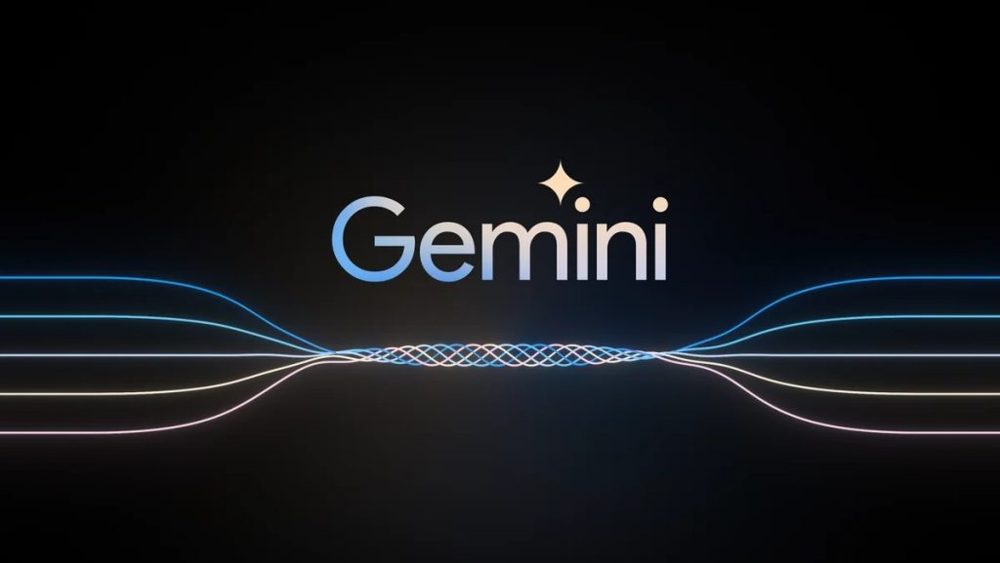

# Multilanguage Invoice Extractor

# Project - Description:

### This Project is based upon the Large Language Model Gemini-Pro powered by Google GenerativeAI. The primary functionality of this project is that it takes an image from users along with a prompt. The prompt facilates the model to generate texual responses based upon the input image which is generated. Irrespective of barrier of Language it can process and generate responses from it. 

# Required Packages:
- streamlit
- google-generativeai
- python-dotenv
- PyPDF2

# You can check the source code for better understanding.

## Let's try out the working demo here 👇🏻
https://multilanguage-invoice-extractor-lqpenikvoi4gesw7z9utrr.streamlit.app/